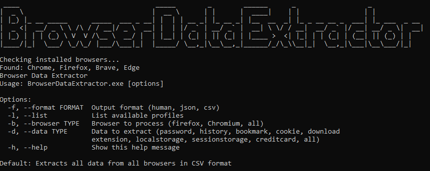

# BrowserDataExtractor-Delphi

BrowserDataExtractor is a Delphi command-line tool for decrypting and exporting browser data (passwords, history, cookies, bookmarks, credit cards, download history, localStorage and extensions) from the browser.

> Disclaimer: This tool is only intended for security research. Users are responsible for all legal and related liabilities resulting from the use of this tool. The original author does not assume any legal responsibility.

## Supported Browser

### Windows
| Browser            | Password | Cookie | Bookmark | History |
|:-------------------|:--------:|:------:|:--------:|:-------:|
| Google Chrome      |    ✅     |   ✅    |    ✅     |    ✅    |   |
| Microsoft Edge     |    ✅     |   ✅    |    ✅     |    ✅    |
| Firefox            |    ✅     |   ✅    |    ✅     |    ✅    |
| Firefox Beta       |    ✅     |   ✅    |    ✅     |    ✅    |
| Firefox Dev        |    ✅     |   ✅    |    ✅     |    ✅    |
| Firefox ESR        |    ✅     |   ✅    |    ✅     |    ✅    |
| Firefox Nightly    |    ✅     |   ✅    |    ✅     |    ✅    |
| 360 Speed          |    ❌     |   ❌    |    ❌     |    ❌    |
| QQ                 |    ❌     |   ❌    |    ❌     |    ❌    |
| Brave              |    ✅     |   ✅    |    ✅     |    ✅    |
| Opera              |    ❌     |   ❌    |    ❌     |    ❌    |
| OperaGX            |    ❌     |   ❌    |    ❌     |    ❌    |
| Vivaldi            |    ❌     |   ❌    |    ❌     |    ❌    |
| Yandex             |    ❌     |   ❌    |    ❌     |    ❌    |
| CocCoc             |    ❌     |   ❌    |    ❌     |    ❌    |
| Internet Explorer  |    ❌     |   ❌    |    ❌     |    ❌    |

More Browser support will be implemented soon.

## 📄 License

This project is intended for educational and recovery purposes only. Please ensure compliance with applicable laws and regulations in your jurisdiction.

# Contributing

Contributions are welcome! If you have suggestions or bug fixes, please fork the repository and submit a pull request.

Made with ❤️ using Delphi RAD Studio
